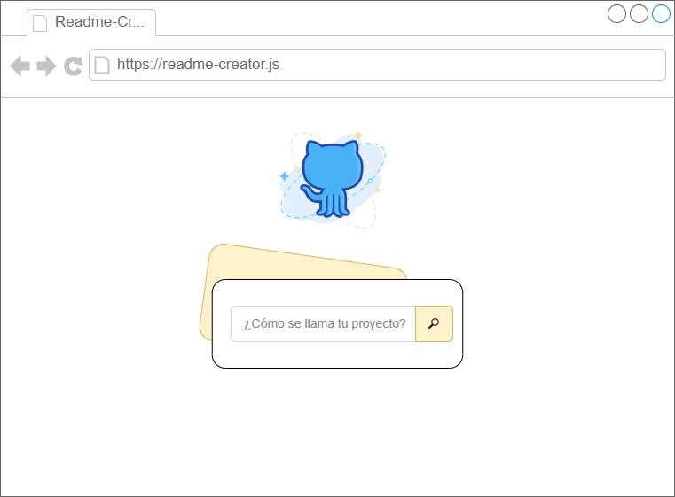
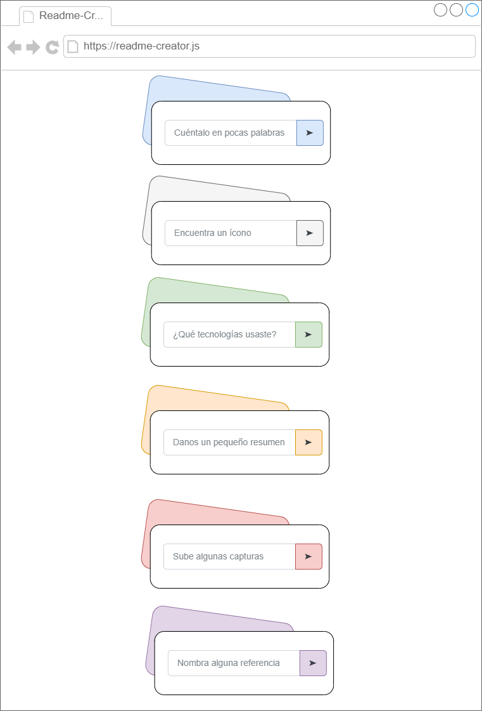

<p align="center">
  </img>
</p>

<div align="center">

# Readme Creator online 

[](https://marfullsen.github.io/readme-creator-online-with-vue/)
[](https://v3.vuejs.org/)
[](https://vitejs.dev/)

</div>

## About

Start your new project with a flexible documentation template. This template streamlines the documentation creation, enabling you to create the ideal documentation that reflects your goals and current status.

## Installing

```bash
git clone https://github.com/Marfullsen/https://github.com/Marfullsen/readme-creator-online-with-vue.git
cd readme-creator-online-with-vue
npm install
npm run dev
```

## Screenshots

<div align="center">
  <a href="https://marfullsen.github.io/" rel="noopener">
  </a>
</div>

<div align="center">
  <a href="https://marfullsen.github.io/" rel="noopener">
  </a>
</div>

## References

- [FAILED VERSION of Readme Creator online using LIT](https://github.com/Marfullsen/readme-creator-online-with-lit)